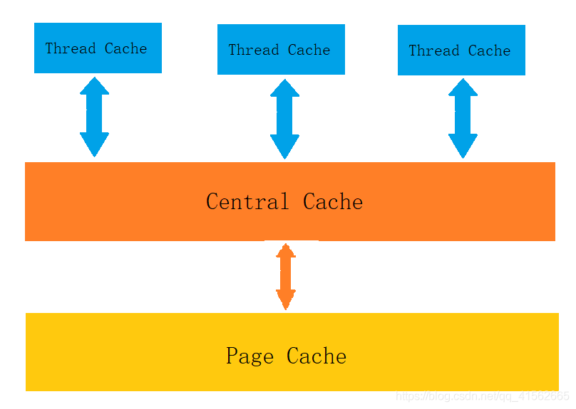
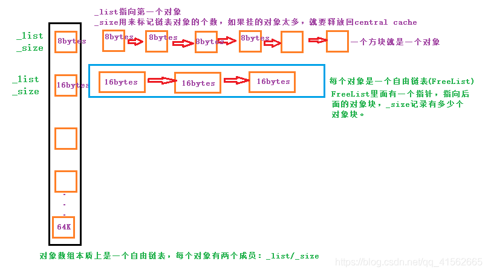
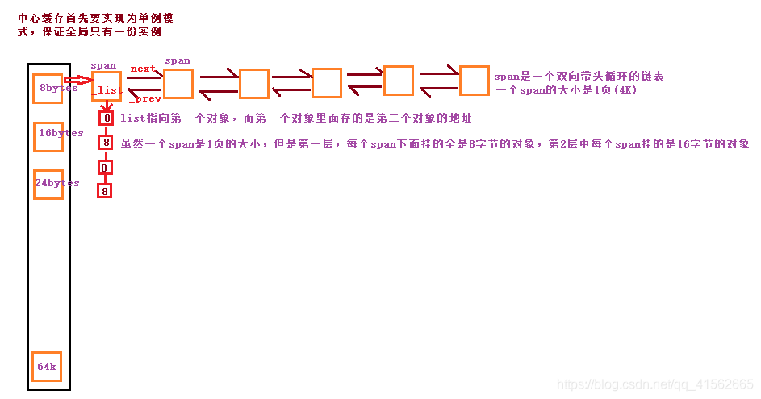

# 实现一个高并发的内存池

## 1. 什么是内存池

### 1.1 池化技术

池是在计算技术中经常使用的一种设计模式，其内涵在于：将程序中需要经常使用的核心资源先申请出来，放到一个池内，有程序自管理，这样可以提高资源的利用率，也可以保证本程序占有的资源数量，经常使用的池化技术包括内存池，线程池，和连接池等，其中尤以内存池和线程池使用最多。
### 1.2 内存池
内存池（Memory Pool）是一种动态内存分配与管理技术，通常情况下，程序员习惯直接使用new，delete，malloc,free等API申请和释放内存，这样导致的后果就是：当程序运行的时间很长的时候，由于所申请的内存块的大小不定，频繁使用时会造成大量的内存碎片从而降低程序和操作系统的性能。
内存池则是在真正使用内存之前，先申请分配一大块内存（内存池）留作备用。当程序员申请内存时，从池中取出一块动态分配，当程序员释放时，将释放的内存放回到池内，再次申请，就可以从池里取出来使用，并尽量与周边的空闲内存块合并。若内存池不够时，则自动扩大内存池，从操作系统中申请更大的内存池。
## 2. 为什么需要内存池
### 2.1 内存碎片问题
   造成堆利用率很低的一个主要原因就是内存碎片化。如果有未使用的存储器，但是这块存储器不能用来满足分配的请求，这时候就会产生内存碎片化问题。内存碎片化分为内部碎片和外部碎片。

**内碎片**

内部碎片是指一个已分配的块比有效载荷大时发生的。(假设以前分配了10个大小的字节，现在只用了5个字节，则剩下的5个字节就会内碎片)。内部碎片的大小就是已经分配的块的大小和他们的有效载荷之差的和。因此内部碎片取决于以前请求内存的模式和分配器实现(对齐的规则)的模式。

**外碎片**

假设系统依次分配了16byte、8byte、16byte、4byte，还剩余8byte未分配。这时要分配一个24byte的空间，操作系统回收了一个上面的两个16byte，总的剩余空间有40byte，但是却不能分配出一个连续24byte的空间，这就是外碎片问题。

### 2.2 申请效率问题
例如：我们上学家里给生活费一样，假设一学期的生活费是6000块。

方式1：开学时6000块直接给你，自己保管，自己分配如何花。

方式2：每次要花钱时，联系父母，父母转钱。

同样是6000块钱，第一种方式的效率肯定更高，因为第二种方式跟父母的沟通交互成本太高了。
同样的道理，程序就像是上学的我们，操作系统就像父母，频繁申请内存的场景下，每次需要内存，都像系统申请效率必然有影响。

## 3.内存池设计
### 3.1 为什么要使用内存池

**解决内碎片问题**

由于向内存申请的内存块都是比较大的，所以能够降低外碎片问题
一次性向内存申请一块大的内存慢慢使用，避免了频繁的向内存请求内存操作，提高内存分配的效率
但是内碎片问题无法避免，只能尽可能的降低
### 3.2 内存池的演变

**最简单的内存分配器**

做一个链表指向空闲内存，分配就是取出一块来，改写链表，返回，释放就是放回到链表里面，并做好归并。注意做好标记和保护，避免二次释放，还可以花点力气在如何查找最适合大小的内存快的搜索上，减少内存碎片，有空你了还可以把链表换成伙伴算法。
优点： 实现简单
缺点： 分配时搜索合适的内存块效率低，释放回归内存后归并消耗大，实际中不实用。

**定长内存分配器**

即实现一个 FreeList，每个 FreeList 用于分配固定大小的内存块，比如用于分配 32字节对象的固定内存分配器，之类的。每个固定内存分配器里面有两个链表，OpenList 用于存储未分配的空闲对象，CloseList用于存储已分配的内存对象，那么所谓的分配就是从 OpenList 中取出一个对象放到 CloseList 里并且返回给用户，释放又是从 CloseList 移回到 OpenList。分配时如果不够，那么就需要增长 OpenList：申请一个大一点的内存块，切割成比如 64 个相同大小的对象添加到 OpenList中。这个固定内存分配器回收的时候，统一把先前向系统申请的内存块全部还给系统。
优点： 简单粗暴，分配和释放的效率高，解决实际中特定场景下的问题有效。
缺点： 功能单一，只能解决定长的内存需求，另外占着内存没有释放。

**哈希映射的FreeList 池**

在定长分配器的基础上，按照不同对象大小(8，16，32，64，128，256，512，1k…64K),构造十多个固定内存分配器，分配内存时根据要申请内存大小进行对齐然后查H表，决定到底由哪个分配器负责，分配后要在内存头部的 header 处写上 cookie，表示由该块内存哪一个分配器分配的，这样释放时候你才能正确归还。如果大于64K，则直接用系统的 malloc作为分配，如此以浪费内存为代价你得到了一个分配时间近似O(1)的内存分配器。这种内存池的缺点是假设某个 FreeList 如果高峰期占用了大量内存即使后面不用，也无法支援到其他内存不够的 FreeList，达不到分配均衡的效果。

优点： 这个本质是定长内存池的改进，分配和释放的效率高。可以解决一定长度内的问题。

缺点： 存在内碎片的问题，且将一块大内存切小以后，申请大内存无法使用。多线程并发场景下，锁竞争激烈，效率降低。

范例： sgi stl 六大组件中的空间配置器就是这种设计实现的。

关于STL空间配置器参考： https://blog.csdn.net/LF_2016/article/details/53511648

**了解malloc底层原理**

关于malloc底层: https://blog.csdn.net/hudazhe/article/details/79535220

malloc优点: 使用自由链表的数组，提高分配释放效率；减少内存碎片，可以合并空闲的内存

malloc缺点: 为了维护隐式/显示链表需要维护一些信息，空间利用率不高；在多线程的情况下，会出现线程安全的问题，如果以加锁的方式解决，会大大降低效率。

## 4.并发内存池
### 4.1 项目介绍
我写这个项目呢，主要是为了学习，参考的是tc_malloc，项目设计分为三层结构：

* 第一层是Thread Cache，线程缓存是每个线程独有的，在这里设计的是用于小于64k的内存分配，线程在这里申请不需要加锁，每一个线程都有自己独立的cache，这也就是这个项目并发高效的地方。
* 第二层是Central Cache，在这里是所有线程共享的，它起着承上启下的作用，Thread Cache是按需要从Central Cache中获取对象，它就要起着平衡多个线程按需调度的作用，既可以将内存对象分配给Thread Cache来的每个线程，又可以将线程归还回来的内存进行管理。Central Cache是存在竞争的，所以在这里取内存对象的时候是需要加锁的，但是锁的力度可以控制得很小。
* 第三层是Page Cache，存储的是以页为单位存储及分配的，Central Cache没有内存对象(Span)时，从Page cache分配出一定数量的Page，并切割成定长大小的小块内存，分配给Central Cache。Page Cache会回收Central Cache满足条件的Span(使用计数为0)对象，并且合并相邻的页，组成更大的页，缓解内存碎片的问题。

注：怎么实现每个线程都拥有自己唯一的线程缓存呢？

为了避免加锁带来的效率，在Thread Cache中使用（tls）thread local storage保存每个线程本地的Thread Cache的指针，这样Thread Cache在申请释放内存是不需要锁的。因为每一个线程都拥有了自己唯一的一个全局变量。

TLS分为静态的和动态的：

静态的TLS是：直接定义

动态的TLS是：调用系统的API去创建的，我们这个项目里面用到的就是静态的TLS
https://blog.csdn.net/evilswords/article/details/8191230
https://blog.csdn.net/yusiguyuan/article/details/22938671
## 4.2 设计Thread Cache

申请内存:

* 当内存申请size<=64k时在Thread Cache中申请内存，计算size在自由链表中的位置，如果自由链表中有内存对象时，直接从FistList[i]中Pop一下对象，时间复杂度是O(1)，且没有锁竞争。
* 当FreeList[i]中没有对象时，则批量从Central Cache中获取一定数量的对象，插入到自由链表并返回一个对象。

释放内存：

* 当释放内存小于64k时将内存释放回Thread Cache，计算size在自由链表中的位置，将对象Push到FreeList[i].
* 当链表的长度过长，也就是超过一次向中心缓存分配的内存块数目时则回收一部分内存对象到Central Cache。

### 4.3 对齐大小的设计（对齐规则）

### 4.4 设计Central Cache

Central Cache本质是由一个哈希映射的Span对象自由双向链表构成

为了保证全局只有唯一的Central Cache，这个类被可以设计成了单例模式

单例模式采用饿汉模式，避免高并发下资源的竞争

申请内存：

当Thread Cache中没有内存时，就会批量向Central Cache申请一些内存对象，Central Cache也有一个哈希映射的freelist，freelist中挂着span，从span中取出对象给Thread Cache，这个过程是需要加锁的。

Central Cache中没有非空的span时，则将空的span链在一起，向Page Cache申请一个span对象，span对象中是一些以页为单位的内存，切成需要的内存大小，并链接起来，挂到span中。

Central Cache的span中有一个_usecount，分配一个对象给Thread Cache，就++_usecount。

释放内存：

当Thread Cache过长或者线程销毁，则会将内存释放回Central Cache中的，释放回来时- -_usecount。

当_usecount减到0时则表示所有对象都回到了span，则将Span释放回Page Cache，Page Cache中会对前后相邻的空闲页进行合并。

特别关心：什么是span?一个span是由多个页组成的一个span对象。一页大小是4k。
